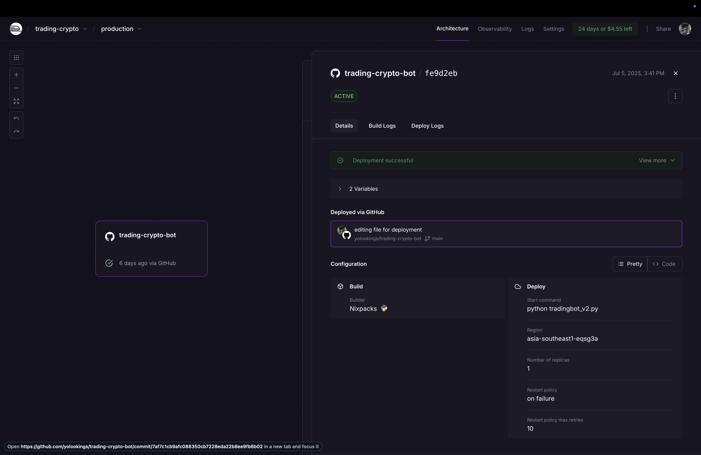

# trading-crypto-bot

Bot ini secara otomatis memantau sinyal trading untuk pasangan kripto (default: BTC/USDT) menggunakan strategi Moving Average (MA) dan Relative Strength Index (RSI). Bot akan mengirimkan notifikasi sinyal BUY/SELL ke Telegram jika semua kondisi terpenuhi.

## Fitur Utama

- Analisis sinyal dengan kombinasi MA (Golden/Death Cross) dan filter RSI
- Deteksi tren utama (BULLISH/BEARISH) berdasarkan MA timeframe lebih besar
- Notifikasi otomatis ke Telegram
- Mudah dideploy di Railway

## Deploy di Railway



## Contoh Hasil Sinyal di Telegram


Contoh pesan sinyal:

```
🚨 SINYAL BARU: BUY UNTUK BTC/USDT 🚨

Harga Saat Ini: $108,148.85
Timeframe Sinyal: 15m

Kondisi Terpenuhi:
✅ Crossover: BUY signal
✅ Tren Utama (4h): BULLISH
✅ RSI (14): 56.27

2025-07-05 11:57:46 - Harap lakukan riset lebih lanjut.
```

```
🚨 SINYAL BARU: SELL UNTUK BTC/USDT 🚨

Harga Saat Ini: $107,705.99
Timeframe Sinyal: 15m

Kondisi Terpenuhi:
✅ Crossover: SELL signal
✅ Tren Utama (4h): BEARISH
✅ RSI (14): 36.05

2025-07-08 02:43:49 - Harap lakukan riset lebih lanjut.
```

---

> Bot ini dibuat untuk tujuan edukasi. Selalu lakukan riset sebelum mengambil keputusan trading.
